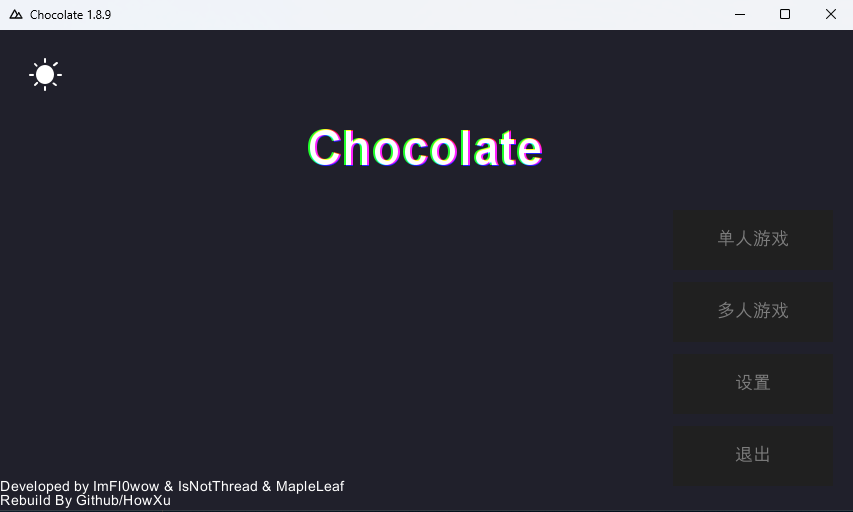
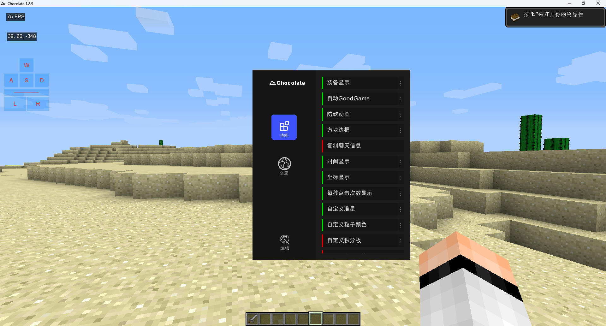
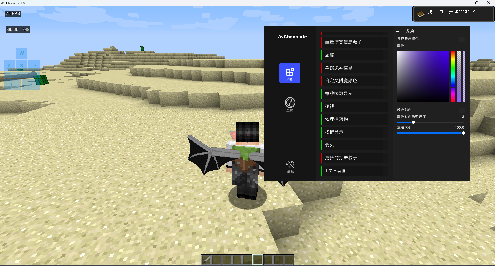

# Chocolate

A Minecraft 1.8.9 Chinese PVP Client based on Tritium-X

> [!CAUTION]\
> 因为MCP项目的特殊性，没有协议能够适配本项目，src源文件分散为三个部分:\
> Tritium-X及本人加入的代码在此仓库，javax和mcp的反混淆代码通过子模块存放在其他仓库中\
> 参考下文**源代码开发**






## 使用方法

1. 前往release页下载发布文件

2. 解压该文件，将得到的名为Chocolate的文件夹移动到你的.minecraft文件夹的versions目录下

3. 使用任意一款启动器选择游戏版本为Chocolate启动

## 为什么改名叫Chocolate？

单纯觉得好听一些

## Chocolate修改了什么？

1. 修改了启动画面，使用百分比布局替代了原本不合理的绝对参数，添加了启动进度条文字描述

2. 删除了第一次进入游戏的语言设置，默认为简体中文

3. 修改了游戏主界面的标题文字，去掉了Welcome提示，修改了四个主要按钮的位置，同样使用了百分比参数来保证不会出现全屏或者小窗口布局错误

4. 对部分入口按钮进行微调，去掉了游戏内登录的功能(现在都是微软登录这个东西意义真不大，而且容易被说后门)

5. 修改了版本json文件中authlib.jar文件来源(与原版1.8.9一致)，也算是去掉一个诟病后面很久的设计。版本json文件附在仓库中

6. 修复了Apache_log4j2(CVE-2021-44228)漏洞，见[知乎 [漏洞复现] Apache_log4j2（CVE-2021-44228）](https://zhuanlan.zhihu.com/p/462419319)，[Minecraft官网公告](https://www.minecraft.net/en-us/article/important-message--security-vulnerability-java-edition)

7. 添加了龙翼渲染功能

8. 添加了游戏内切换服务器的功能

9. 使用方正舒黑平替原有的微软雅黑字体减少游戏文件大小

## 源代码开发

本项目需要拉取分散的mcp反混淆后的mc代码和内置的javax源代码两个模块，你应该使用以下命令克隆：

```bash
git clone --recursive git@github.com:HowXu/Chocolate.git
```
或者在正常克隆后运行以下命令拉取子模块：

```bash
git submodule init
git submodule update
```

本项目依赖[Chocolate_Gradle](https://github.com/HowXu/chocolate_gradle)插件，因此可以适应各种开发环境

拉取依赖(必要):
```bash
./gradlew check
```

获取运行时资源(必要):
```bash
./gradlew getRuntimeResources
```

构建单独jar包(在build/libs目录下):
```bash
./gradlew build
```

构建发布文件(在build/cache目录下):
```bash
./gradlew buildArch
```

运行客户端:
```bash
./gradlew runClient
```


动态库资源涉及压缩文件校验，如果误删请使用以下命令补全:
> [!NOTE]\
> 该过程包含在getRuntimeResources步骤中，无需重复执行
```bash
./gradlew getNativesResources
```


## 源代码感谢

感谢[GitHub - ImFl0wow/Tritium-Open](https://github.com/ImFl0wow/Tritium-Open) 源代码

感谢[GitHub - Canelex/DragonWingsMod](https://github.com/Canelex/DragonWingsMod) 龙翼组件

感谢[OPPO](https://www.coloros.com/article/A00000050/) OPPOSans字体提供
